# ANALYSE ET SPÉCIFICATION DES BESOINS
## Plateforme de Gestion Académique et Administrative – ISA

---

## 1. DIAGRAMMES DE CAS D'UTILISATION PAR ACTEUR

### 1.1 Diagramme Étudiant (17 cas d'utilisation)

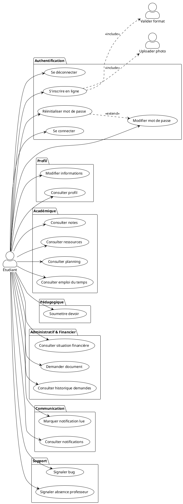

---

### 1.2 Diagramme Professeur (15 cas d'utilisation)

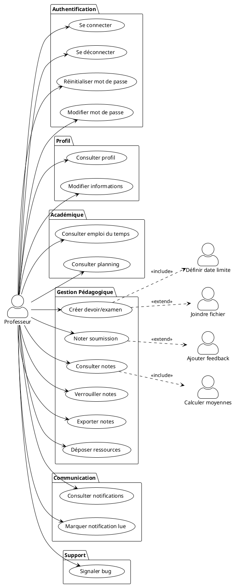

---

### 1.3 Diagramme Administrateur (23 cas d'utilisation)

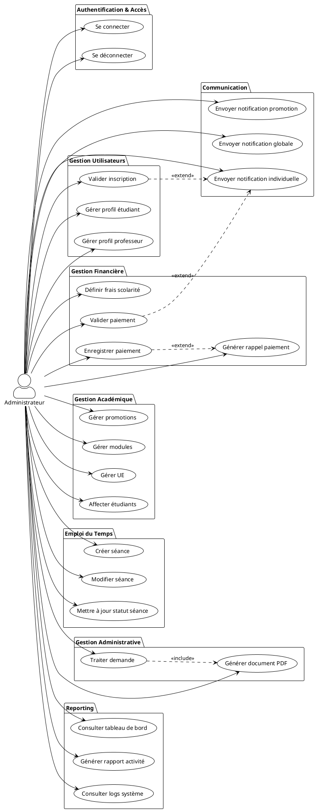

---

### 1.4 Diagramme Super Admin (25 cas d'utilisation - Admin + 2 spécifiques)

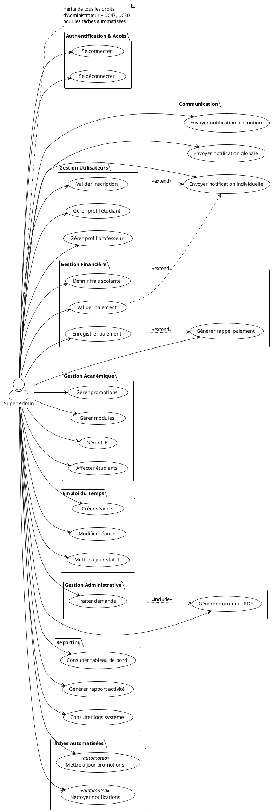

---

## 2. DIAGRAMMES DE CAS D'UTILISATION DÉTAILLÉS PAR MODULE

### 2.1 Module Gestion Authentification et Utilisateurs

```plantuml
@startuml
!theme plain
skinparam actorStyle awesome

title Cas d'Utilisation Détaillés - Authentification & Gestion Utilisateurs

' Acteurs
actor "Étudiant" as Student
actor "Professeur" as Professor
actor "Administrateur" as Admin
actor "Système Email" as EmailSystem

' Cas d'utilisation principaux
rectangle "Gestion Authentification" {
    usecase "Se connecter" as Login
    usecase "Se déconnecter" as Logout
    usecase "S'inscrire en ligne" as Register
    usecase "Réinitialiser mot de passe" as ResetPwd
    usecase "Modifier mot de passe" as ChangePwd
    usecase "Valider format données" as ValidateFormat
    usecase "Vérifier identifiants" as CheckCredentials
    usecase "Créer session" as CreateSession
    usecase "Envoyer email confirmation" as SendEmail
    usecase "Générer token temporaire" as GenerateToken
}

rectangle "Gestion Utilisateurs" {
    usecase "Valider inscription" as ValidateRegister
    usecase "Générer matricule" as GenerateMatricule
    usecase "Créer compte utilisateur" as CreateAccount
    usecase "Consulter profil" as ViewProfile
    usecase "Modifier informations\npersonnelles" as UpdateProfile
    usecase "Uploader photo identité" as UploadPhoto
    usecase "Gérer profil étudiant" as ManageStudent
    usecase "Gérer profil professeur" as ManageProfessor
    usecase "Activer/Désactiver compte" as ToggleAccount
}

' Relations acteurs principaux
Student --> Register
Student --> Login
Student --> Logout
Student --> ResetPwd
Student --> ChangePwd
Student --> ViewProfile
Student --> UpdateProfile

Professor --> Login
Professor --> Logout
Professor --> ResetPwd
Professor --> ChangePwd
Professor --> ViewProfile
Professor --> UpdateProfile

Admin --> Login
Admin --> Logout
Admin --> ValidateRegister
Admin --> ManageStudent
Admin --> ManageProfessor
Admin --> ToggleAccount

' Includes
Register ..> ValidateFormat : <<include>>
Register ..> UploadPhoto : <<include>>
Register ..> SendEmail : <<include>>
Login ..> CheckCredentials : <<include>>
Login ..> CreateSession : <<include>>
ResetPwd ..> GenerateToken : <<include>>
ResetPwd ..> SendEmail : <<include>>
ValidateRegister ..> GenerateMatricule : <<include>>
ValidateRegister ..> CreateAccount : <<include>>
ValidateRegister ..> SendEmail : <<include>>

' Extends
Login ..> "Bloquer compte\n(tentatives échouées)" : <<extend>>
Register ..> "Vérifier email unique" : <<extend>>
UpdateProfile ..> UploadPhoto : <<extend>>

' Relations système
EmailSystem -- SendEmail

@enduml
```

### 2.2 Module Gestion Pédagogique

```plantuml
@startuml
!theme plain
skinparam actorStyle awesome

title Cas d'Utilisation Détaillés - Gestion Pédagogique

' Acteurs
actor "Étudiant" as Student
actor "Professeur" as Professor
actor "Administrateur" as Admin
actor "Système Notification" as NotifSystem

' Cas d'utilisation
rectangle "Gestion Devoirs/Examens" {
    usecase "Créer devoir/examen" as CreateAssignment
    usecase "Modifier devoir" as EditAssignment
    usecase "Supprimer devoir" as DeleteAssignment
    usecase "Activer/Désactiver devoir" as ToggleAssignment
    usecase "Définir date limite" as SetDeadline
    usecase "Joindre fichier sujet" as AttachFile
    usecase "Consulter liste devoirs" as ListAssignments
}

rectangle "Gestion Soumissions" {
    usecase "Soumettre devoir en ligne" as SubmitOnline
    usecase "Modifier soumission" as EditSubmission
    usecase "Télécharger fichier" as DownloadFile
    usecase "Consulter statut soumission" as ViewSubmissionStatus
    usecase "Vérifier date limite" as CheckDeadline
    usecase "Enregistrer soumission\nprésentielle" as SubmitInPerson
}

rectangle "Gestion Notes" {
    usecase "Noter soumission" as GradeSubmission
    usecase "Modifier note" as EditGrade
    usecase "Ajouter feedback" as AddFeedback
    usecase "Verrouiller notes" as LockGrades
    usecase "Consulter notes" as ViewGrades
    usecase "Calculer moyennes" as CalculateAverage
    usecase "Exporter notes (Excel)" as ExportGrades
    usecase "Générer bulletin" as GenerateBulletin
}

rectangle "Ressources Pédagogiques" {
    usecase "Déposer ressource" as UploadResource
    usecase "Modifier ressource" as EditResource
    usecase "Supprimer ressource" as DeleteResource
    usecase "Consulter ressources" as ViewResources
    usecase "Télécharger ressource" as DownloadResource
    usecase "Catégoriser ressource" as CategorizeResource
}

' Relations Professeur
Professor --> CreateAssignment
Professor --> EditAssignment
Professor --> DeleteAssignment
Professor --> ToggleAssignment
Professor --> ListAssignments
Professor --> GradeSubmission
Professor --> EditGrade
Professor --> AddFeedback
Professor --> LockGrades
Professor --> ViewGrades
Professor --> ExportGrades
Professor --> UploadResource
Professor --> EditResource
Professor --> DeleteResource
Professor --> ViewResources
Professor --> SubmitInPerson

' Relations Étudiant
Student --> ListAssignments
Student --> SubmitOnline
Student --> EditSubmission
Student --> ViewSubmissionStatus
Student --> ViewGrades
Student --> ViewResources
Student --> DownloadResource
Student --> DownloadFile

' Relations Admin
Admin --> ViewGrades
Admin --> GenerateBulletin

' Includes
CreateAssignment ..> SetDeadline : <<include>>
CreateAssignment ..> AttachFile : <<extend>>
SubmitOnline ..> CheckDeadline : <<include>>
SubmitOnline ..> AttachFile : <<include>>
GradeSubmission ..> AddFeedback : <<extend>>
ViewGrades ..> CalculateAverage : <<include>>
UploadResource ..> CategorizeResource : <<include>>

' Extends
CreateAssignment ..> NotifSystem : <<extend>>
SubmitOnline ..> NotifSystem : <<extend>>
GradeSubmission ..> NotifSystem : <<extend>>
EditGrade ..> "Vérifier verrouillage" : <<extend>>
SubmitOnline ..> "Marquer en retard" : <<extend>>

@enduml
```

### 2.3 Module Gestion Administrative et Financière

```plantuml
@startuml
!theme plain
skinparam actorStyle awesome

title Cas d'Utilisation Détaillés - Gestion Administrative & Financière

' Acteurs
actor "Étudiant" as Student
actor "Administrateur" as Admin
actor "Système PDF" as PDFSystem
actor "Système Email" as EmailSystem

' Cas d'utilisation
rectangle "Demandes Administratives" {
    usecase "Demander document" as RequestDoc
    usecase "Sélectionner type document" as SelectDocType
    usecase "Préciser motif" as SpecifyReason
    usecase "Consulter statut demande" as ViewRequestStatus
    usecase "Consulter historique\ndemandes" as ViewHistory
    
    usecase "Traiter demande" as ProcessRequest
    usecase "Valider/Rejeter demande" as ValidateRequest
    usecase "Générer document PDF" as GeneratePDF
    usecase "Ajouter QR code\nvérification" as AddQRCode
    usecase "Marquer document délivré" as MarkDelivered
    usecase "Consulter toutes demandes" as ViewAllRequests
}

rectangle "Gestion Documents" {
    usecase "Générer attestation\ninscription" as GenCertificate
    usecase "Générer relevé notes" as GenTranscript
    usecase "Générer diplôme" as GenDiploma
    usecase "Signer document" as SignDocument
    usecase "Archiver document" as ArchiveDocument
}

rectangle "Gestion Financière" {
    usecase "Définir frais scolarité" as SetTuitionFees
    usecase "Définir échéancier" as SetSchedule
    usecase "Enregistrer paiement" as RecordPayment
    usecase "Uploader preuve paiement" as UploadProof
    usecase "Valider paiement" as ValidatePayment
    usecase "Consulter situation\nfinancière" as ViewFinancial
    usecase "Calculer solde" as CalculateBalance
    usecase "Générer reçu" as GenerateReceipt
    usecase "Débloquer compte" as UnblockAccount
    usecase "Bloquer compte (impayés)" as BlockAccount
    usecase "Générer rappel paiement" as SendReminder
    usecase "Consulter historique\npaiements" as ViewPaymentHistory
}

rectangle "Notifications Financières" {
    usecase "Notifier échéance proche" as NotifyDeadline
    usecase "Notifier paiement reçu" as NotifyPayment
    usecase "Notifier compte bloqué" as NotifyBlock
}

' Relations Étudiant
Student --> RequestDoc
Student --> ViewRequestStatus
Student --> ViewHistory
Student --> ViewFinancial
Student --> UploadProof
Student --> ViewPaymentHistory

' Relations Administrateur
Admin --> ViewAllRequests
Admin --> ProcessRequest
Admin --> ValidateRequest
Admin --> GeneratePDF
Admin --> MarkDelivered
Admin --> SetTuitionFees
Admin --> SetSchedule
Admin --> RecordPayment
Admin --> ValidatePayment
Admin --> GenerateReceipt
Admin --> UnblockAccount
Admin --> BlockAccount
Admin --> SendReminder

' Includes
RequestDoc ..> SelectDocType : <<include>>
RequestDoc ..> SpecifyReason : <<include>>
ProcessRequest ..> ValidateRequest : <<include>>
GeneratePDF ..> AddQRCode : <<include>>
GeneratePDF ..> SignDocument : <<include>>
RecordPayment ..> CalculateBalance : <<include>>
RecordPayment ..> GenerateReceipt : <<include>>
ViewFinancial ..> CalculateBalance : <<include>>

' Extends
GeneratePDF ..> GenCertificate : <<extend>>
GeneratePDF ..> GenTranscript : <<extend>>
GeneratePDF ..> GenDiploma : <<extend>>
ProcessRequest ..> ArchiveDocument : <<extend>>
RecordPayment ..> UnblockAccount : <<extend>>
ValidatePayment ..> NotifyPayment : <<extend>>

' Relations automatiques
BlockAccount ..> NotifyBlock
SendReminder ..> NotifyDeadline

' Relations systèmes externes
PDFSystem -- GeneratePDF
PDFSystem -- AddQRCode
EmailSystem -- SendReminder
EmailSystem -- NotifyPayment

@enduml
```

---

## 3. PRIORISATION DES CAS D'UTILISATION

### 2.1 Critères de Priorisation

Les cas d'utilisation sont classés selon trois critères :
- **Priorité Métier** : Impact sur les fonctionnalités essentielles
- **Complexité Technique** : Difficulté d'implémentation
- **Dépendances** : Pré-requis par d'autres cas d'utilisation

### 2.2 Matrice de Priorisation

| Priorité | Cas d'Utilisation | Acteurs | Complexité | Justification |
|----------|-------------------|---------|------------|---------------|
| **P0 - CRITIQUE** | | | | **Fonctionnalités bloquantes** |
| P0.1 | UC1 - Se connecter | Tous | Moyenne | Base de toute interaction |
| P0.2 | UC2 - Se déconnecter | Tous | Faible | Sécurité essentielle |
| P0.3 | UC5 - S'inscrire en ligne | Étudiant | Moyenne | Point d'entrée système |
| P0.4 | UC6 - Valider inscription | Admin | Moyenne | Création des comptes |
| **P1 - HAUTE** | | | | **Cœur métier académique** |
| P1.1 | UC11 - Gérer promotions | Admin | Moyenne | Structure académique |
| P1.2 | UC12 - Gérer modules | Admin | Moyenne | Organisation enseignements |
| P1.3 | UC14 - Affecter étudiants | Admin | Moyenne | Lien étudiant-promotion |
| P1.4 | UC16 - Créer devoir/examen | Professeur | Moyenne | Activité pédagogique |
| P1.5 | UC17 - Soumettre devoir | Étudiant | Moyenne | Participation étudiante |
| P1.6 | UC18 - Noter soumission | Professeur | Moyenne | Évaluation |
| P1.7 | UC19 - Consulter notes | Étudiant/Prof | Faible | Suivi pédagogique |
| P1.8 | UC15 - Consulter emploi du temps | Tous | Faible | Organisation quotidienne |
| **P2 - MOYENNE** | | | | **Fonctionnalités importantes** |
| P2.1 | UC24 - Créer séance | Admin | Moyenne | Gestion planning |
| P2.2 | UC26 - Consulter planning | Tous | Faible | Visibilité planning |
| P2.3 | UC22 - Déposer ressources | Professeur | Moyenne | Matériel pédagogique |
| P2.4 | UC23 - Consulter ressources | Étudiant | Faible | Accès contenu |
| P2.5 | UC29 - Demander document | Étudiant | Faible | Service administratif |
| P2.6 | UC30 - Traiter demande | Admin | Moyenne | Gestion administrative |
| P2.7 | UC34 - Enregistrer paiement | Admin | Moyenne | Gestion financière |
| P2.8 | UC35 - Consulter situation financière | Étudiant | Faible | Transparence |
| P2.9 | UC38 - Envoyer notification individuelle | Admin | Faible | Communication |
| P2.10 | UC41 - Consulter notifications | Tous | Faible | Information |
| **P3 - BASSE** | | | | **Confort et optimisation** |
| P3.1 | UC3 - Réinitialiser mot de passe | Tous | Moyenne | Récupération compte |
| P3.2 | UC4 - Modifier mot de passe | Tous | Faible | Sécurité personnelle |
| P3.3 | UC9 - Consulter profil | Tous | Faible | Gestion compte |
| P3.4 | UC10 - Modifier informations | Tous | Faible | Mise à jour données |
| P3.5 | UC20 - Verrouiller notes | Professeur | Faible | Protection données |
| P3.6 | UC21 - Exporter notes | Professeur | Moyenne | Reporting |
| P3.7 | UC27 - Signaler absence professeur | Étudiant | Faible | Feedback |
| P3.8 | UC31 - Générer document PDF | Système | Haute | Automatisation |
| P3.9 | UC39 - Notification promotion | Admin | Faible | Communication ciblée |
| P3.10 | UC40 - Notification globale | Admin | Faible | Annonces générales |
| P3.11 | UC43 - Tableau de bord | Admin | Moyenne | Supervision |
| P3.12 | UC45 - Signaler bug | Tous | Faible | Qualité système |
| **P4 - AUTOMATISÉES** | | | | **Tâches planifiées** |
| P4.1 | UC47 - Mettre à jour promotions | Système | Moyenne | Automatisation |
| P4.2 | UC48 - Vérifier emplois du temps | Système | Faible | Maintenance |
| P4.3 | UC49 - Rappels automatiques | Système | Moyenne | Communication auto |
| P4.4 | UC50 - Nettoyer notifications | Système | Faible | Optimisation BDD |

### 2.3 Planning de Développement par Sprint

#### **Sprint 1 (2 semaines) - Fondations**
- UC1, UC2 : Authentification base
- UC5 : Inscription en ligne
- UC6 : Validation inscription
- Infrastructure : BDD, sessions, middleware

#### **Sprint 2 (2 semaines) - Structure Académique**
- UC11 : Gestion promotions
- UC12 : Gestion modules
- UC13 : Gestion UE
- UC14 : Affectation étudiants

#### **Sprint 3 (2 semaines) - Pédagogie Cœur**
- UC16 : Création devoirs/examens
- UC17 : Soumission devoirs
- UC18 : Notation
- UC19 : Consultation notes

#### **Sprint 4 (2 semaines) - Planning & Ressources**
- UC15 : Consultation emploi du temps
- UC24 : Création séances
- UC22 : Dépôt ressources
- UC23 : Consultation ressources

#### **Sprint 5 (2 semaines) - Administratif & Financier**
- UC29, UC30 : Demandes administratives
- UC31 : Génération PDF
- UC33, UC34, UC35 : Gestion financière

#### **Sprint 6 (1 semaine) - Communication**
- UC38, UC39, UC40 : Notifications
- UC41, UC42 : Gestion notifications

#### **Sprint 7 (1 semaine) - Reporting & Automatisation**
- UC43, UC44 : Tableaux de bord
- UC47-50 : Tâches CRON
- UC45, UC46 : Logs et bugs

#### **Sprint 8 (1 semaine) - Finitions**
- UC3, UC4 : Gestion mots de passe
- UC20, UC21 : Fonctionnalités avancées notes
- Tests et corrections

---

## 4. DIAGRAMMES DE SÉQUENCE SYSTÈME

### 4.1 UC1 - Se Connecter

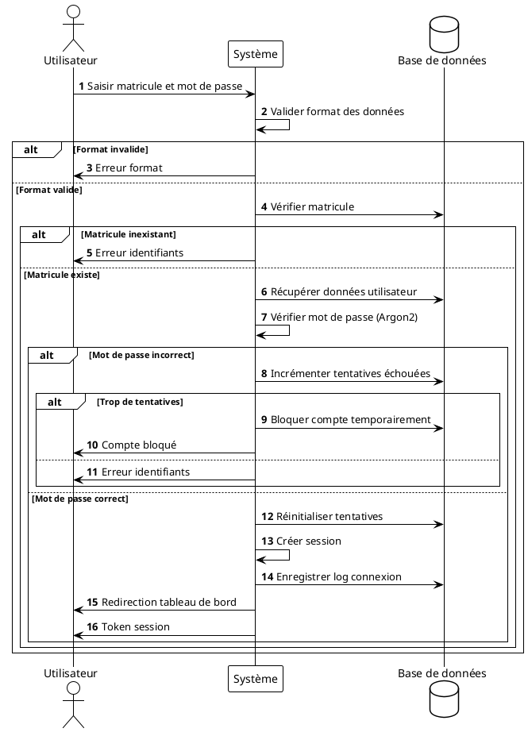

### 4.2 UC5 - S'inscrire en Ligne

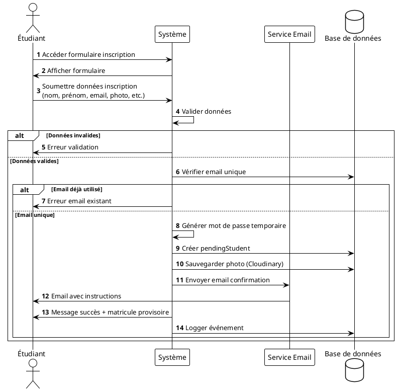

### 4.3 UC6 - Valider Inscription

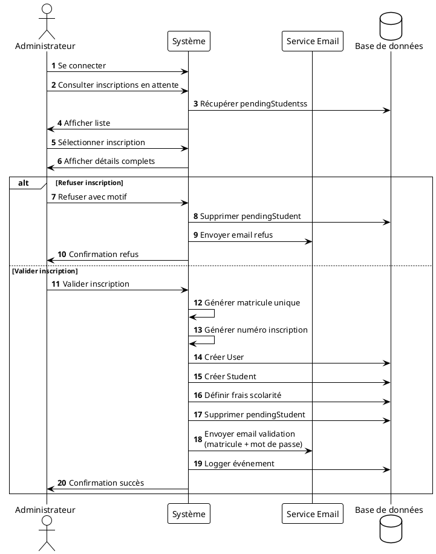

### 4.4 UC16 - Créer Devoir/Examen

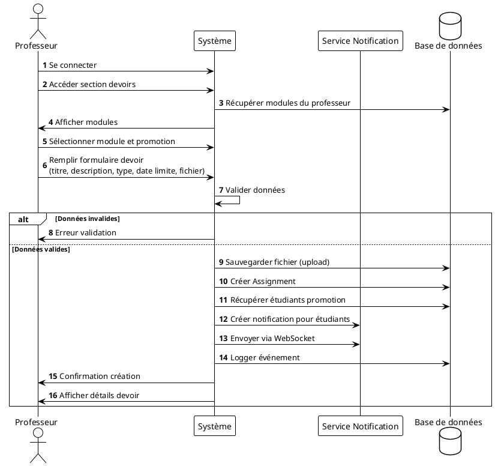

### 4.5 UC17 - Soumettre Devoir

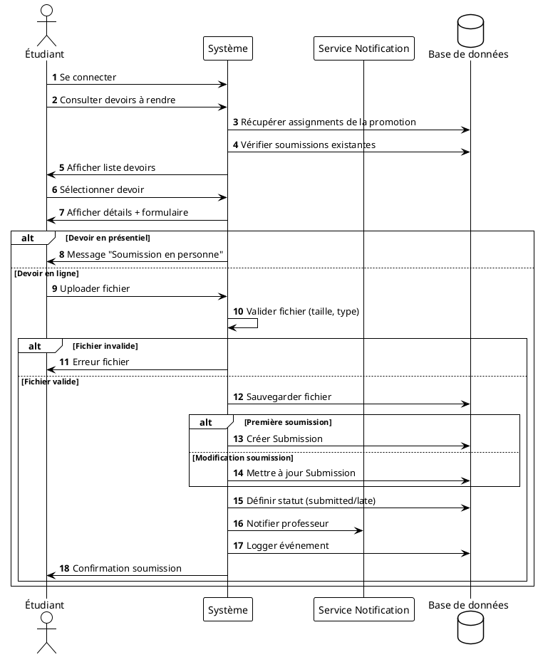

### 4.6 UC18 - Noter Soumission

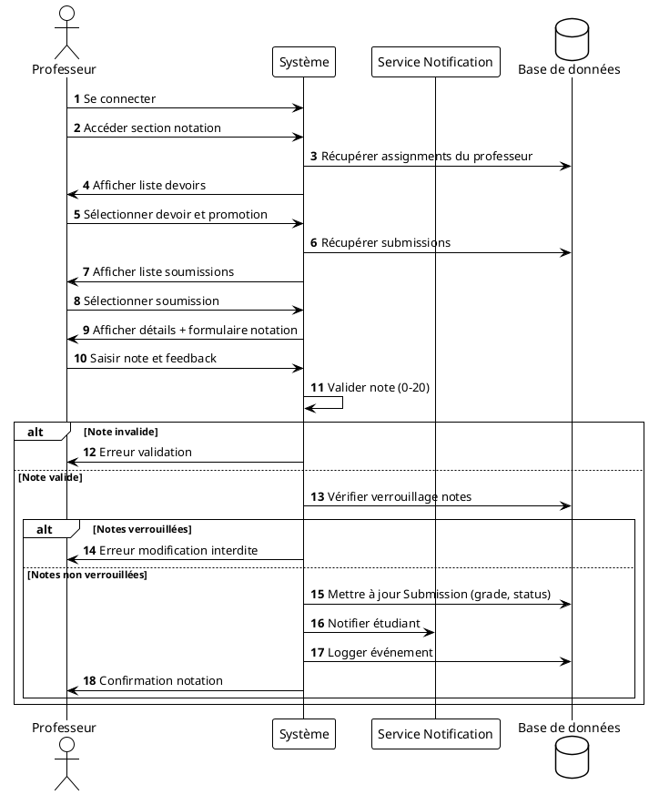

### 4.7 UC19 - Consulter Notes

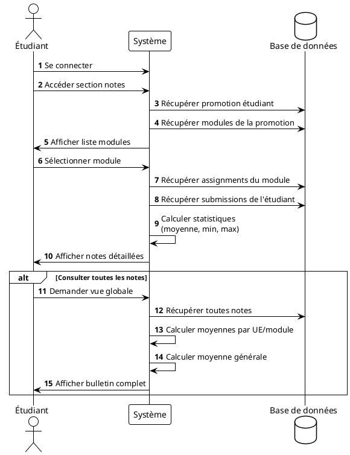

### 4.8 UC24 - Créer Séance

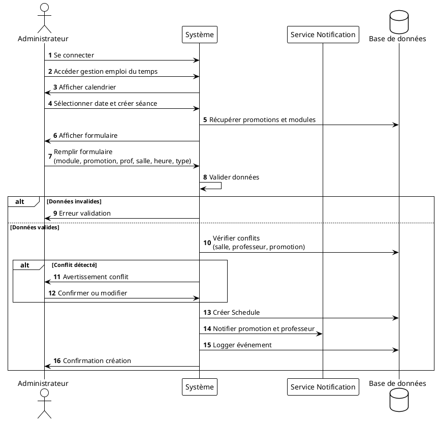

### 4.9 UC29 - Demander Document

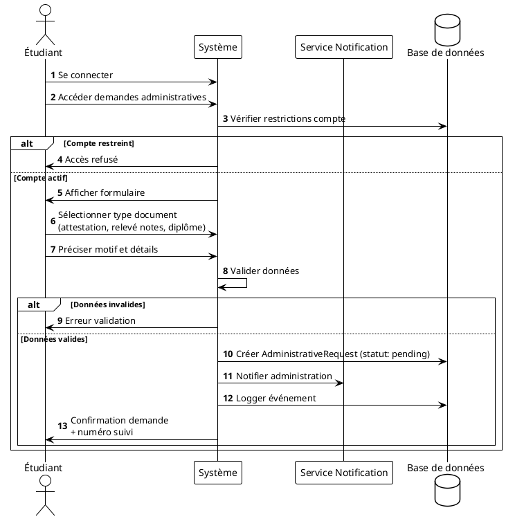

### 4.10 UC30 - Traiter Demande Administrative

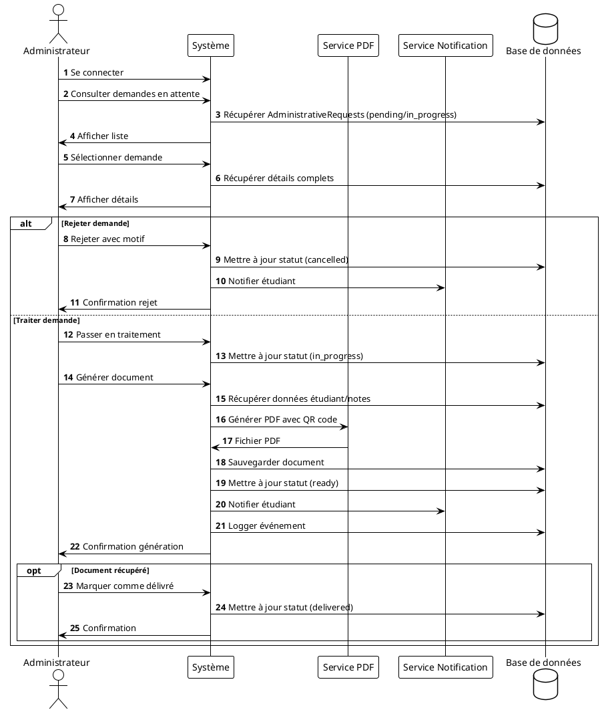

### 4.11 UC34 - Enregistrer Paiement

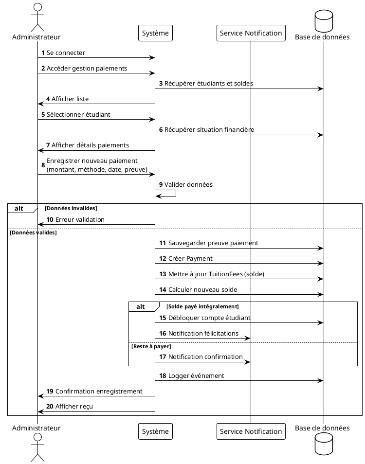


### 4.12 Gérer UE et Module

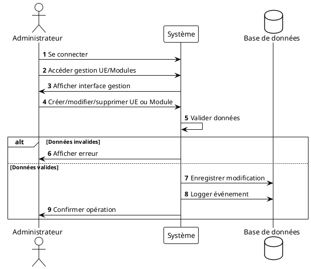

### 4.13 Gérer Utilisateur

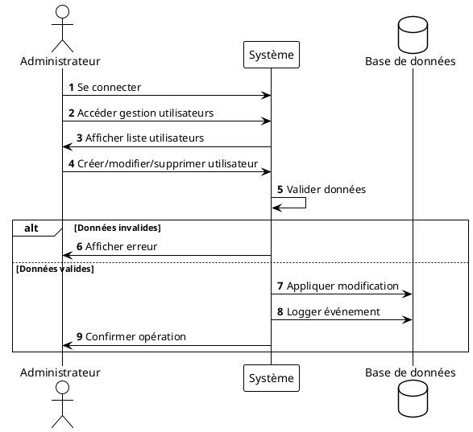

### 4.14 Gérer Traçabilité des Actions

```plantuml
@startuml
!theme plain
autonumber

actor "Utilisateur" as User
participant "Système" as System
database "Base de données" as DB

User -> System : Effectuer action (ex: modification)
System -> DB : Appliquer modification
System -> DB : Enregistrer événement dans journal d'audit
System -> User : Confirmer action

@enduml
```

### 4.15 Déposer et Gérer Ressources Pédagogiques

```plantuml
@startuml
!theme plain
autonumber

actor "Professeur" as Prof
participant "Système" as System
database "Base de données" as DB
participant "Stockage Fichiers" as Storage

Prof -> System : Se connecter
Prof -> System : Accéder gestion ressources
System -> Prof : Afficher interface dépôt
Prof -> System : Déposer/éditer/supprimer ressource
System -> System : Valider données
alt Données invalides
    System -> Prof : Afficher erreur
else Données valides
    System -> Storage : Enregistrer/mettre à jour/supprimer fichier
    System -> DB : Mettre à jour référence ressource
    System -> DB : Logger événement
    System -> Prof : Confirmer opération
end

@enduml
```

### 4.15 UC49 - Envoi Rappels Automatiques (CRON)

```plantuml
@startuml
!theme plain
autonumber

participant "CRON" as Cron
participant "Système" as System
participant "Service Email" as Mail
participant "Service Notification" as Notif
database "Base de données" as DB

Cron -> System : Déclenchement tâche quotidienne
System -> DB : Récupérer date actuelle

' Rappels paiements
System -> DB : Récupérer étudiants avec solde impayé
loop Pour chaque étudiant en retard
    System -> DB : Vérifier date échéance
    alt Échéance dépassée
        System -> Mail : Envoyer rappel paiement
        System -> Notif : Créer notification
        System -> DB : Logger rappel
    end
end

' Rappels devoirs
System -> DB : Récupérer assignments avec deadline proche (J-2)
loop Pour chaque devoir
    System -> DB : Récupérer étudiants n'ayant pas soumis
    System -> Notif : Envoyer notification rappel
    System -> DB : Logger rappel
end

' Rappels séances à venir
System -> DB : Récupérer séances du lendemain
loop Pour chaque séance
    System -> DB : Récupérer étudiants et professeur
    System -> Notif : Envoyer notification rappel
    System -> DB : Logger rappel
end

System -> Cron : Fin exécution

@enduml
```

---

## 5. SPÉCIFICATIONS COMPLÉMENTAIRES

### 5.1 Acteurs et Responsabilités

| Acteur | Description | Permissions Principales |
|--------|-------------|------------------------|
| **Étudiant** | Utilisateur en formation | Consulter (emploi du temps, notes, ressources), Soumettre (devoirs), Demander (documents) |
| **Professeur** | Enseignant de l'établissement | Créer (devoirs, ressources), Noter (soumissions), Consulter (emploi du temps, notes) |
| **Administrateur** | Personnel administratif | Gérer (utilisateurs, promotions, modules), Valider (inscriptions, paiements), Créer (emploi du temps, notifications) |
| **Super Admin** | Administrateur système | ✅ **TOUTES les permissions d'Admin** + UC47 (Mise à jour promotions), UC50 (Nettoyage notifications) |

**Notes :** 
- SuperAdmin hérite de tous les droits d'Administrateur (relation `--|>` en UML)
- SuperAdmin a accès additionnellement à UC47 et UC50 pour la gestion des tâches automatisées
- Les cas d'utilisation UC47-UC50 sont des processus automatisés (stéréotype `<<automated>>`) déclenchés par des événements temporels (planificateur de tâches), et non par un acteur externe

### 5.2 Règles de Gestion Principales

#### RG1 - Authentification
- Le matricule est unique par utilisateur
- Le mot de passe doit contenir minimum 8 caractères
- Après 5 tentatives échouées, le compte est bloqué 30 minutes
- Les sessions expirent après 7 jours d'inactivité

#### RG2 - Inscription
- L'email doit être unique dans le système
- La photo d'identité est obligatoire
- L'inscription n'est active qu'après validation admin
- Un matricule définitif est généré à la validation (format: ISAYYYY-NNNN)

#### RG3 - Académique
- Un étudiant ne peut être affecté qu'à une seule promotion active
- Un module appartient à une seule unité d'enseignement
- Une promotion contient plusieurs modules
- Un professeur peut enseigner plusieurs modules

#### RG4 - Notation
- Les notes sont comprises entre 0 et 20
- Une fois verrouillées, les notes ne peuvent plus être modifiées
- Un étudiant ne peut avoir qu'une soumission par devoir
- Les soumissions après la deadline sont marquées "late"

#### RG5 - Financier
- Les frais de scolarité sont définis par promotion et année
- Un paiement partiel est autorisé
- Le solde doit être >= 0 (pas de crédit)
- Les comptes avec impayés > 30 jours sont restreints

#### RG6 - Notifications
- Les notifications critiques déclenchent un email
- Les notifications expirent après 30 jours
- Les notifications peuvent être individuelles, par promotion ou globales

### 5.3 Contraintes Techniques

- **Sécurité** : Toutes les API nécessitent une authentification sauf login/inscription
- **Performance** : Les requêtes doivent répondre en < 2 secondes
- **Disponibilité** : Le système doit être disponible 99% du temps
- **Scalabilité** : Support de 500 utilisateurs simultanés minimum
- **Données** : Sauvegarde quotidienne de la base de données
- **Logs** : Conservation des logs pendant 1 an minimum

### 5.4 Traçabilité (Event Logs)

Tous les événements suivants sont tracés :
- Connexions/déconnexions
- Création/modification/suppression d'entités
- Soumissions de devoirs
- Modifications de notes
- Paiements
- Génération de documents
- Changements de statut

Format log : `{ userId, entityType, entityId, action, timestamp, metadata }`

---

## 6. GLOSSAIRE

| Terme | Définition |
|-------|------------|
| **Assignment** | Devoir, projet ou examen créé par un professeur |
| **Submission** | Soumission d'un devoir par un étudiant |
| **Promotion** | Niveau d'études (L1, L2, L3, M1, M2) dans une filière |
| **Module** | Matière enseignée (ex: Analyse 1, Algorithmique) |
| **UE** | Unité d'Enseignement regroupant plusieurs modules |
| **Schedule** | Séance de cours dans l'emploi du temps |
| **TuitionFees** | Frais de scolarité d'un étudiant pour une année |
| **Payment** | Paiement effectué par un étudiant |
| **Matricule** | Identifiant unique de l'utilisateur (format: ISAYYYY-NNNN) |
| **Pending Student** | Étudiant en attente de validation d'inscription |
| **Session** | Session d'examen (normal ou rattrapage) |
| **EventLog** | Trace d'un événement système |
| **Restriction** | Blocage d'un compte étudiant (généralement pour impayés) |

---

_Document rédigé dans le cadre de l'analyse des besoins – ISA Ambato_  
_Date : Janvier 2026_
