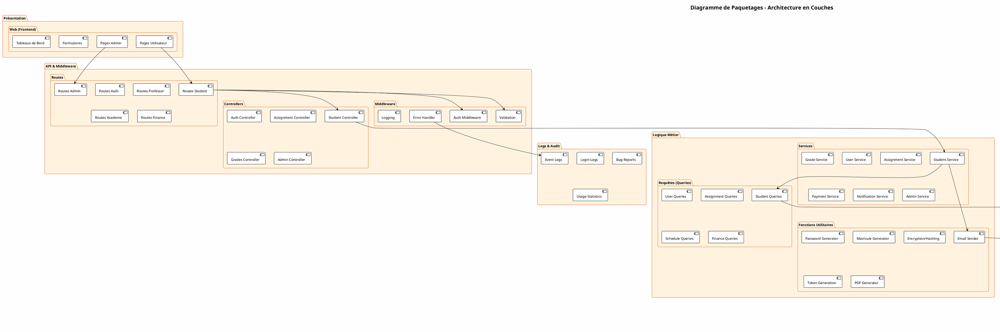
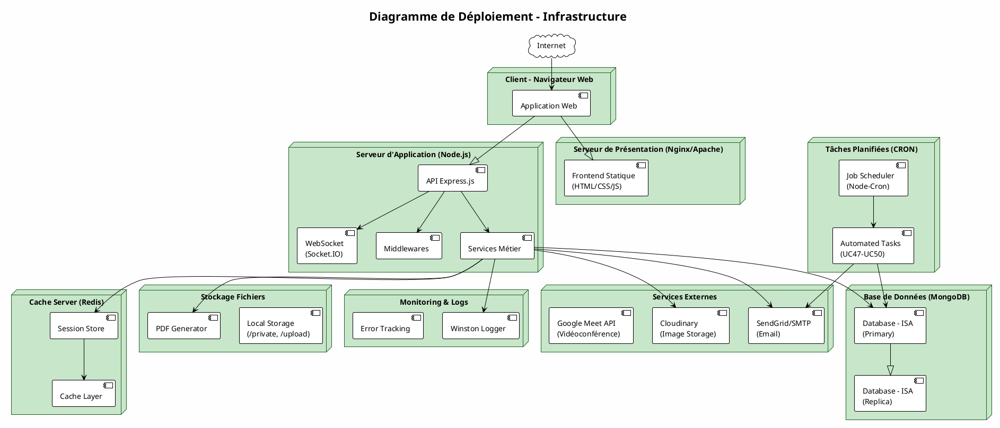
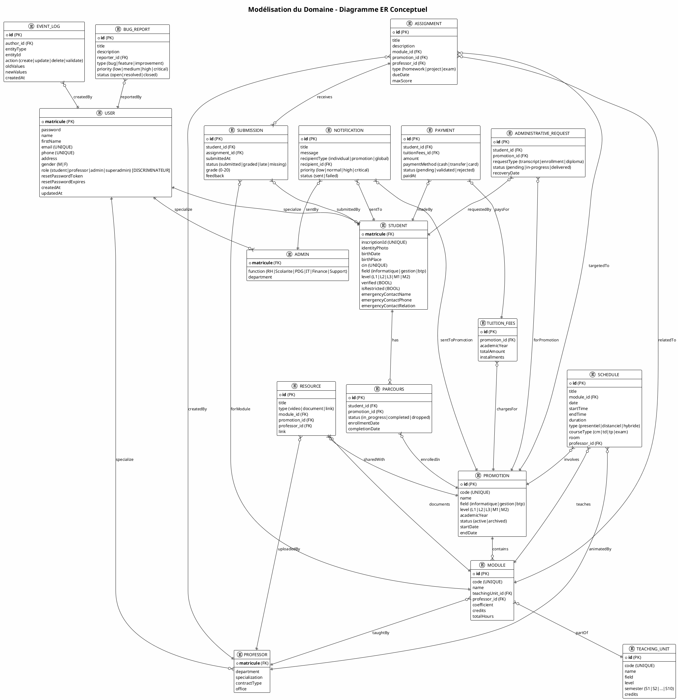

# DIAGRAMMES DE CONCEPTION
## Plateforme de Gestion Académique et Administrative – ISA

---

## 1. DIAGRAMME DE CLASSE DE CONCEPTION GLOBAL

```plantuml
@startuml
!theme plain
skinparam backgroundColor #FEFEFE
skinparam classBackgroundColor #E1F5FE
skinparam classBorderColor #01579B
skinparam arrowColor #01579B

title Diagramme de Classe - Architecture Complète

' ==================== COUCHE AUTHENTIFICATION ====================
package "Authentification & Gestion Utilisateurs" {
    abstract class User {
        # id: ObjectId
        # matricule: String (PK)
        # password: String (hashed)
        # name: String
        # firstName: String
        # email: String
        # phone: String
        # address: String
        # gender: Enum (male|female)
        # role: Enum (discriminator)
        # resetPasswordToken: String
        # resetPasswordExpires: DateTime
        # configs: Object
        # createdAt: DateTime
        # updatedAt: DateTime
        --
        +authenticate(): Boolean
        +resetPassword(): Token
        +updateProfile(): void
        +logout(): void
    }

    class Student {
        # inscriptionId: String (UK)
        # identityPhoto: String
        # birthDate: Date
        # birthPlace: String
        # cin: String (UK)
        # idDocument: String
        # residenceCertificate: String
        # bacTranscript: String
        # emergencyContactName: String
        # emergencyContactPhone: String
        # emergencyContactRelation: String
        # field: Enum (informatique|gestion|btp)
        # level: Enum (L1-M2)
        # previousInstitution: String
        # promotionYear: Integer
        # parcours: Parcours[]
        # verified: Boolean
        # isRestricted: Boolean
        # terms: Object
        --
        +submitAssignment(): Submission
        +consultGrades(): Grade[]
        +requestDocument(): AdministrativeRequest
    }

    class Professor {
        # department: String
        # contractType: Enum
        # specialization: String
        # office: String
        --
        +createAssignment(): Assignment
        +gradeSubmission(): void
        +uploadResource(): Resource
    }

    class Admin {
        # function: Enum (RH|Scolarite|PDG|IT|Finance|Support)
        # department: String
        --
        +validateStudent(): void
        +managePromotion(): void
        +processRequest(): void
    }

    class SuperAdmin {
        # function: Enum
        # systemAccess: Boolean
        --
        +scheduleAutomatedTask(): void
        +manageAdmins(): void
    }

    class PendingStudent {
        # id: ObjectId
        # inscriptionId: String (UK)
        # firstName: String
        # lastName: String
        # birthDate: Date
        # gender: Enum
        # email: String (UK)
        # phone: String (UK)
        # field: Enum
        # levelAsked: Enum
        # status: Enum (pending|approved|rejected)
        # token: String
        # expiredToken: Boolean
        --
        +confirm(): void
        +reject(): void
    }

    class LoginAttempt {
        # id: ObjectId
        # matricule: String (FK)
        # attemptCount: Integer
        # lastAttemptAt: DateTime
        # blockedUntil: DateTime
        # isBlocked: Boolean
    }

    User <|-- Student
    User <|-- Professor
    User <|-- Admin
    Admin <|-- SuperAdmin
    User "1" --* "many" LoginAttempt : tracks
}

' ==================== COUCHE ACADÉMIQUE ====================
package "Gestion Académique" {
    class Promotion {
        # id: ObjectId
        # code: String (UK)
        # name: String
        # field: Enum
        # level: Enum
        # academicYear: String
        # status: Enum (active|archived)
        # studentCount: Integer
        # capacity: Integer
        # startDate: Date
        # endDate: Date
        --
        +getStudents(): Student[]
        +getModules(): Module[]
    }

    class TeachingUnit {
        # id: ObjectId
        # code: String (UK)
        # name: String
        # field: Enum
        # level: Enum
        # semester: Enum (S1-S10)
        # credits: Integer
        # description: String
    }

    class Module {
        # id: ObjectId
        # code: String (UK)
        # name: String
        # teachingUnit: FK
        # professor: FK
        # coefficient: Decimal
        # credits: Integer
        # totalHours: Integer
        # cmHours, tdHours, tpHours: Integer
        --
        +getTeachingUnit(): TeachingUnit
        +getProfessor(): Professor
    }

    class Parcours {
        # promotion: FK
        # status: Enum (in_progress|completed|dropped|repeated)
        # enrollmentDate: Date
        # completionDate: DateTime
    }

    Promotion "1" --* "many" Module : contains
    Promotion "1" --* "many" Parcours : defines
    TeachingUnit "1" --* "many" Module : groups
    Professor "1" --* "many" Module : teaches
    Student "1" --* "many" Parcours : has_history
}

' ==================== COUCHE PÉDAGOGIQUE ====================
package "Gestion Pédagogique" {
    class Assignment {
        # id: ObjectId
        # title: String
        # description: String
        # module: FK
        # promotion: FK
        # professor: FK
        # type: Enum (homework|project|exam)
        # session: Enum (normal|rattrapage)
        # dueDate: DateTime
        # fileUrl: String
        # maxScore: Integer
        # isActive: Boolean
        # lockedGrade: Boolean
        --
        +lockGrades(): void
        +getSubmissions(): Submission[]
    }

    class Submission {
        # id: ObjectId
        # student: FK
        # assignment: FK
        # fileUrl: String
        # submittedAt: DateTime
        # isLate: Boolean
        # status: Enum (submitted|graded|late|missing)
        # grade: Decimal (0-20)
        # feedback: String
        # gradedAt: DateTime
        # gradedBy: FK (Professor)
        --
        +submit(): void
        +grade(): void
    }

    class Resource {
        # id: ObjectId
        # title: String
        # description: String
        # type: Enum (video|document|external_link)
        # module: FK
        # promotion: FK
        # professor: FK
        # link: String
        # downloadCount: Integer
        # isVisible: Boolean
        --
        +download(): void
    }

    class GradesAuthentication {
        # id: ObjectId
        # promotion: FK
        # student: FK
        # uniqueToken: String (UK)
        --
        +verifyToken(): Boolean
    }

    Assignment "1" --* "many" Submission : has
    Submission "*" --o "1" Student
    Submission "*" --o "1" Module
    Resource "*" --o "1" Module
    Student "1" --* "many" GradesAuthentication : owns
}

' ==================== COUCHE ADMINISTRATIVE ====================
package "Gestion Administrative" {
    class Schedule {
        # id: ObjectId
        # promotions: FK[]
        # module: FK
        # title: String
        # courseType: Enum (cm|td|tp|exam)
        # type: Enum (presentiel|distanciel|hybride)
        # date: Date
        # startTime: String
        # endTime: String
        # duration: Integer
        # room: String
        # professor: FK
        # googleMeetLink: String
        # status: Enum (pending|done|missed)
        # studentReclamations: FK[]
        --
        +recordAttendance(): void
        +updateStatus(): void
    }

    class AdministrativeRequest {
        # id: ObjectId
        # matricule: String
        # student: FK
        # promotion: FK
        # requestType: Enum (transcript|enrollment_certificate|diploma)
        # status: Enum (pending|in-progress|recoverable|delivered|cancelled)
        # recoveryDate: Date
        # handledBy: FK (Admin)
        # documentUrl: String
        # qrCode: String
        --
        +process(): void
        +generateDocument(): void
    }

    Schedule "1" --* "many" Promotion : involves
    Module "1" --* "many" Schedule : has_sessions
    AdministrativeRequest "*" --o "1" Student
    AdministrativeRequest "*" --o "1" Promotion
}

' ==================== COUCHE FINANCIÈRE ====================
package "Gestion Financière" {
    class TuitionFees {
        # id: ObjectId
        # promotion: FK
        # academicYear: String
        # totalAmount: Decimal
        # currency: String
        # installments: Integer
        # paymentSchedule: Object[]
        # description: String
    }

    class Payment {
        # id: ObjectId
        # student: FK
        # tuitionFees: FK
        # amount: Decimal
        # currency: String
        # paymentMethod: Enum (cash|bank_transfer|cheque|card|momo)
        # transactionId: String
        # proofFile: String
        # status: Enum (pending|validated|rejected)
        # validatedBy: FK (Admin)
        # paidAt: DateTime
        --
        +validate(): void
        +reject(): void
    }

    class FeesManagement {
        # id: ObjectId
        # student: FK
        # promotion: FK
        # totalFees: Decimal
        # totalPaid: Decimal
        # balance: Decimal (calculated)
        # isFullyPaid: Boolean
        # lastPaymentDate: DateTime
        # status: Enum (current|overdue|completed)
        --
        +calculateBalance(): Decimal
        +sendReminder(): void
    }

    TuitionFees "1" --* "many" Payment : defines
    Promotion "1" --* "many" TuitionFees : charges
    Student "1" --* "many" Payment : makes
    Student "1" --* "many" FeesManagement : tracks
}

' ==================== COUCHE COMMUNICATION ====================
package "Communication & Notifications" {
    class Notification {
        # id: ObjectId
        # title: String
        # message: String
        # recipientType: Enum (individual|promotion|global)
        # recipientId: FK
        # priority: Enum (low|normal|high|critical)
        # type: Enum (info|warning|success|error|alert)
        # channels: String[] (in-app|email|sms)
        # status: Enum (sent|failed|pending)
        # createdBy: FK (Admin)
        # expiresAt: DateTime
        --
        +send(): void
        +markAsRead(): void
    }

    class NotificationSeen {
        # id: ObjectId
        # notification: FK
        # user: FK
        # readAt: DateTime
        # isRead: Boolean
    }

    Notification "1" --* "many" NotificationSeen : tracks_read
    NotificationSeen "*" --o "1" User
}

' ==================== COUCHE AUDIT & LOGS ====================
package "Audit & Logs" {
    class EventLog {
        # id: ObjectId
        # authorId: FK (User)
        # authorName: String
        # entityType: Enum
        # entityId: FK
        # action: Enum (create|read|update|delete|validate)
        # oldValues: Object
        # newValues: Object
        # status: Enum (success|failure)
        # ipAddress: String
        # createdAt: DateTime
    }

    class LoginLog {
        # id: ObjectId
        # userId: FK
        # status: Enum (success|failed|blocked)
        # loginAt: DateTime
        # logoutAt: DateTime
        # ipAddress: String
    }

    class BugReport {
        # id: ObjectId
        # title: String
        # type: Enum (bug|feature|improvement|other)
        # description: String
        # reporter: FK
        # priority: Enum (low|medium|high|critical)
        # isResolved: Boolean
        # createdAt: DateTime
    }

    EventLog "*" --o "1" User : logged_by
    LoginLog "*" --o "1" User : tracks
    BugReport "*" --o "1" User : reported_by
}

' ==================== COUCHE CONFIGURATION ====================
package "Configuration & Système" {
    class Setting {
        # id: ObjectId
        # key: String (UK)
        # value: Mixed
        # category: String
        # type: Enum (string|integer|boolean|decimal|json)
    }

    class Counter {
        # id: ObjectId
        # sequence: String (UK)
        # nextValue: Integer
        # prefix: String
        # padLength: Integer
    }

    class CronTask {
        # id: ObjectId
        # name: String
        # description: String
        # schedule: String (cron expression)
        # lastRun: DateTime
        # nextRun: DateTime
        # isActive: Boolean
    }
}

@enduml
```

---

## 2. DIAGRAMME DE PAQUETAGES

---

## 3. DIAGRAMME DE DÉPLOIEMENT

---

## 4. MODÉLISATION DU DOMAINE (MCD - Entité-Relation Conceptuel)

---

## LÉGENDE & CONVENTIONS

### Diagramme de Classe
- **Classes abstraites** : italique
- **Héritage** : `<|--`
- **Composition** : `*--`
- **Agrégation** : `o--`
- **Dépendance** : `-->`

### Diagramme de Paquetages
- Couches logiques séparées (présentation → métier → données → infra)
- Dépendances unidirectionnelles (haut → bas)

### Diagramme de Déploiement
- **Nœuds physiques** : serveurs, BDD, services externes
- **Artefacts** : composants logiciels
- **Connexions** : communication entre nœuds

### Modélisation du Domaine (MCD)
- **Entités** : rectangles
- **Attributs** : listés dedans (PK*, FK, UK)
- **Relations** : connecteurs (1:1, 1:N, N:M)
- **Cardinalités** : ||, }o, ||--o

---

_Diagrammes générés avec PlantUML – Janvier 2026_
