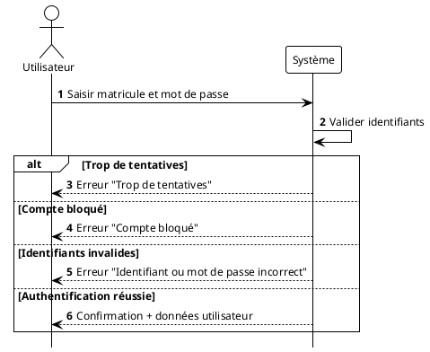
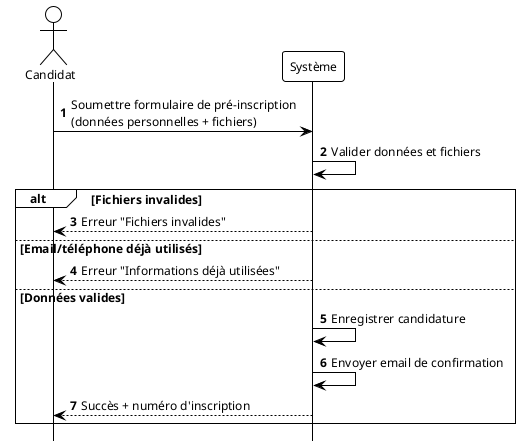
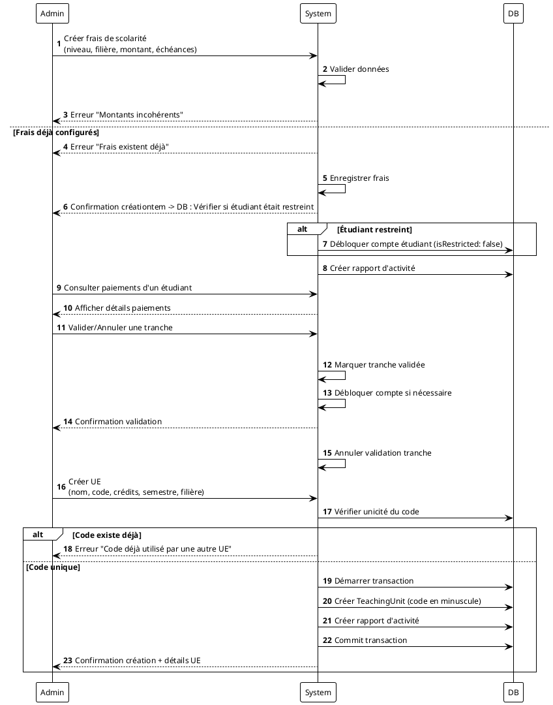
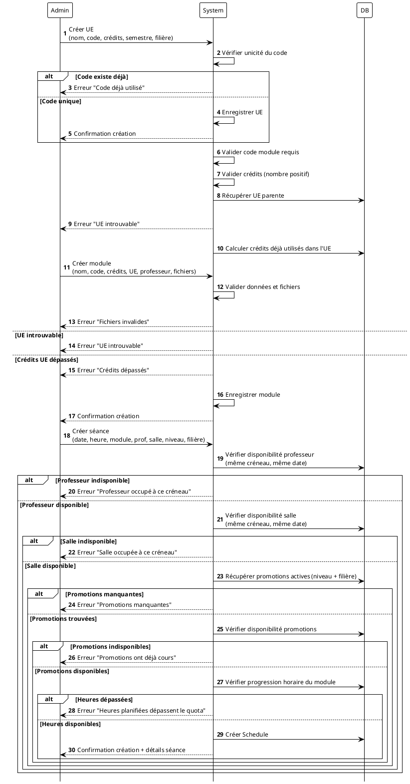
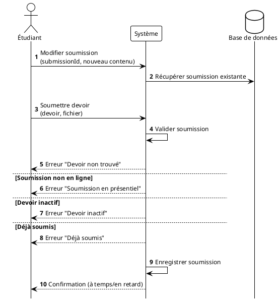
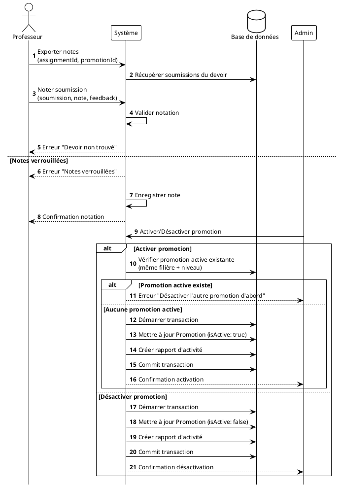

# DIAGRAMMES DE SÉQUENCE SYSTÈME
## Plateforme de Gestion Académique et Administrative – ISA

---

## 1. Se Connecter (Login)



---

## 2. Se Pré-inscrire (Soumission dossier candidature)



---

## 3. Valider Pré-inscription (Approuver candidature)

```plantuml
@startuml
!theme plain
autonumber

skinparam defaultFontName "Times New Roman"
skinparam defaultFontSize 12
hide footbox

actor "Administrateur" as Admin
participant "Système" as System
participant "Service Email" as Mail
database "Base de données" as DB

Admin -> System : Consulter liste des pré-inscriptions
System -> DB : Récupérer PendingStudents avec pagination
System --> Admin : Afficher liste des candidats

Admin -> System : Sélectionner un dossier
System -> DB : Récupérer détails complets + décrypter CIN
System --> Admin : Afficher détails du dossier

alt Rejeter la candidature
    Admin -> System : Rejeter avec motif
    System -> DB : Démarrer transaction
    System -> DB : Supprimer PendingStudent + fichiers
    System -> DB : Créer rapport d'activité
    System -> DB : Commit transaction
    System --> Admin : Confirmation rejet
else Approuver la candidature
    Admin -> System : Approuver le dossier
    System -> DB : Vérifier existence frais de scolarité (niveau/filière)
    
    alt Frais non configurés
        System --> Admin : Erreur "Configurer les frais de scolarité d'abord"
    else Frais configurés
        System -> DB : Démarrer transaction

Admin -> System : Consulter liste des pré-inscriptions
System --> Admin : Afficher liste des candidats

Admin -> System : Sélectionner un dossier
System --> Admin : Afficher détails complets

alt Rejeter la candidature
    Admin -> System : Rejeter avec motif
    System -> System : Supprimer candidature
    System --> Admin : Confirmation rejet
else Approuver la candidature
    Admin -> System : Approuver le dossier
    System -> System : Vérifier frais de scolarité configurés
    
    alt Frais non configurés
        System --> Admin : Erreur "Configurer les frais de scolarité"
    else Frais configurés
        System -> System : Générer lien d'admission
        System -> System : Envoyer email d'admission
Student -> System : Accéder au lien d'inscription (token)
System -> System : Vérifier rate limit
System -> DB : Rechercher PendingStudent par token hashé

alt Token invalide ou expiré
    System --> Student : Erreur "Lien invalide ou expiré"
else Token valide
    System --> Student : Afficher formulaire de confirmation\n(paiement première tranche)

Student -> System : Accéder au lien d'inscription (token)
System -> System : Vérifier validité du lien

alt Token invalide ou expiré
    System --> Student : Erreur "Lien invalide ou expiré"
else Token valide
    System --> Student : Afficher formulaire de confirmation

    Student -> System : Soumettre paiement première tranche\n(méthode, référence, preuve)
    System -> System : Valider paiement
    
    alt Référence déjà utilisée
        System --> Student : Erreur "Référence déjà utilisée"
    else Paiement valide
        System -> System : Créer compte étudiant
        System -> System : Générer matricule
        System -> System : Envoyer email de bienvenue
        System --> Student : Succès + matricule et mot de pass
!theme plain
autonumber

skinparam defaultFontName "Times New Roman"
skinparam defaultFontSize 12
hide footbox

actor "Administrateur" as Admin
participant "Système" as System
database "Base de données" as DB

Admin -> System : Créer une nouvelle promotion\n(nom, niveau, filière, années)
System -> DB : Vérifier si promotion existe déjà (par nom)

alt Promotion existe
    System --> Admin : Erreur "La promotion existe déjà"
else Promotion n'existe pas
    System -> System : Valider année début < année fin
    
    alt Années invalides
        System --> Admin : Erreur "Années invalides"
    else Années valides
        System -> System : Valider niveau (L1, L2, L3)
        System -> System : Valider filière (informatique, gestion, btp)
        
        alt Données invalides
            System --> Admin : Erreur validation
        else Données valides
            System -> DB : Démarrer transaction
            System -> DB : Créer Promotion
            System -> DB : Créer rapport d'activité
            System -> DB : Commit transaction
            System --> Admin : Confirmation création + détails promotion
        end
    end
end

@enduml
```




Admin -> System : Créer nouvelle promotion\n(nom, niveau, filière, années)
System -> System : Valider données

alt Promotion existe déjà
    System --> Admin : Erreur "Promotion existe déjà"
else Années invalides
    System --> Admin : Erreur "Années invalides"
else Niveau ou filière invalide
    System --> Admin : Erreur "Données invalides"
else Données valides
    System -> System : Enregistrer promotion
    System --> Admin : Confirmation création Frais existent
        System --> Admin : Erreur "Frais déjà configurés pour ce niveau"
    else Frais n'existent pas
        System -> DB : Créer FeesManagement
        System --> Admin : Confirmation création
    end
end

@enduml
```

---

## 7. Valider Paiement Frais de Scolarité



---

## 9. Créer Module




Admin -> System : Créer séance\n(date, heure, module, prof, salle, promotions)
System -> System : Vérifier disponibilités

alt Professeur indisponible
    System --> Admin : Erreur "Professeur occupé"
else Salle indisponible
    System --> Admin : Erreur "Salle occupée"
else Promotions indisponibles
    System --> Admin : Erreur "Promotions ont cours"
else Heures module dépassées
    System --> Admin : Erreur "Quota d'heures dépassé"
else Disponibilités OK
    System -> System : Enregistrer séance
    System --> Admin : Confirmation création
```plantuml
@startuml
!theme plain
autonumber

skinparam defaultFontName "Times New Roman"
skinparam defaultFontSize 12
hide footbox

actor "Professeur" as Prof
participant "Système" as System
database "Base de données" as DB

Prof -> System : Créer devoir/examen\n(titre, description, type, date limite, module)

System -> DB : Récupérer module avec UE
alt Module invalide
    System --> Prof : Erreur "Module invalide"
else Module valide
    System -> System : Vérifier que le professeur est assigné au module
    
    alt Professeur non autorisé
        System --> Prof : Erreur "Non autorisé pour ce module"
    else Professeur autorisé
        System -> DB : Récupérer promotion active (filière + niveau)
        
        alt Aucune promotion active
            System --> Prof : Erreur "Aucune promotion active"
        else Promotion trouvée
            System -> System : Valider date limite (pas dans le passé)
            
            alt Date invalide
                System --> Prof : Erreur "Date dans le passé"
            else Date valide
                alt Type = Examen
                    System -> DB : Vérifier examens existants (session)
                    
                    alt Session déjà existante
                        System --> Prof : Erreur "Examen de cette session existe déjà"
                    end

User -> System : Consulter emploi du temps\n(plage de dates)
System -> System : Vérifier authentification

alt Non authentifié
    System --> User : Erreur "Non autorisé"
else Authentifié
    System -> System : Récupérer séances
    System --> User : Afficher emploi du temp

---

## 13. Soumettre Devoir (Étudiant)

```plantuml
@startuml
!theme plain
autonumber

Prof -> System : Créer devoir/examen\n(titre, type, date limite, module)
System -> System : Valider données

alt Module invalide
    System --> Prof : Erreur "Module invalide"
else Professeur non autorisé
    System --> Prof : Erreur "Non autorisé"
else Aucune promotion active
    System --> Prof : Erreur "Aucune promotion active"
else Date limite invalide
    System --> Prof : Erreur "Date invalide"
else Examen session existe
    System --> Prof : Erreur "Session déjà créée"
else Données valides
    System -> System : Enregistrer devoir
    System --> Prof : Confirmation création         else Soumission dans les délais
                    System -> System : Définir statut = "submitted"
                end
                
                System -> DB : Créer Submission
                System --> Student : Confirmation soumission + statut
            end
        end
    end
end

@enduml
```

---

## 14. Modifier Soumission (Étudiant)



---

## 15. Noter Soumission (Professeur)



---

## 19. Soumettre Preuve de Paiement (Étudiant)

```plantuml
@startuml
!theme plain
autonumber

skinparam defaultFontName "Times New Roman"
skinparam defaultFontSize 12
hide footbox

Student -> System : Consulter notes (module)
System -> System : Récupérer notes de l'étudiant

alt Module invalide
    System --> Student : Erreur "Module invalide"
else Module valide
    System --> Student : Afficher notes + moyenn
    System -> System : Vérifier propriétaire
    
    alt Étudiant non propriétaire
        System --> Student : Erreur "Non autorisé"
    else Étudiant propriétaire

Prof -> System : Exporter notes (devoir, promotion)
System -> System : Récupérer soumissions

alt Aucune soumission
    System --> Prof : Erreur "Aucune soumission"
else Soumissions trouvées
    System -> System : Générer fichier Excel
    System --> Prof : Télécharger fichiertion
                System -> DB : Mettre à jour installment\n(méthode, référence, preuve, date)
                System -> DB : Commit transaction
                System --> Student : Confirmation soumission
            end
        end
    end
end

@enduml
```

---

## 20. Réinitialiser Mot de Passe

```plantuml
@startuml
!theme plain
autonumber

skinparam defaultFontName "Times New Roman"
skinparam defaultFontSize 12
hide footbox

Admin -> System : Activer/Désactiver promotion

alt Activer promotion
    System -> System : Vérifier promotion active existante
    
    alt Promotion active existe
        System --> Admin : Erreur "Désactiver l'autre d'abord"
    else OK
        System -> System : Activer promotion
        System --> Admin : Confirmation activation
    end
else Désactiver promotion
    System -> System : Désactiver promo
            System --> User : Erreur "Lien déjà envoyé"
        else Pas de token valide
            System -> System : Générer token aléatoire
            System -> System : Définir expiration (24h)
            System -> DB : Sauvegarder token hashé
            System -> Mail : Envoyer email avec lien
            System --> User : Confirmation envoi email
        end
    end
end

@enduml
```

---

## Légende

| Symbole | Signification |
|---------|---------------|
| `->` | Appel synchrone |
| `-->` | Réponse |
| `alt/else` | Alternatives (conditions) |
| `opt` | Optionnel |
| `loop` | Boucle |
| `DB` | Base de données MongoDB |

Student -> System : Soumettre preuve paiement\n(tranche, méthode, référence, fichier)
System -> System : Valider paiement

alt Frais non trouvés
    System --> Student : Erreur "Frais introuvables"
else Non autorisé
    System --> Student : Erreur "Non autorisé"
else Tranche invalide
    System --> Student : Erreur "Tranche invalide"
else Déjà payée
    System --> Student : Erreur "Déjà payée"
else Paiement valide
    System -> System : Enregistrer preuve
    System --> Student : Confirmation soumission
User -> System : Demander réinitialisation (matricule)
System -> System : Valider demande

alt Utilisateur non trouvé
    System --> User : Erreur "Utilisateur introuvable"
else Changement récent
    System --> User : Erreur "Réessayez dans X jours"
else Lien déjà envoyé
    System --> User : Erreur "Lien déjà envoyé"
else Demande valide
    System -> System : Générer lien de réinitialisation
    System -> System : Envoyer email
    System --> User : Confirmation envoi